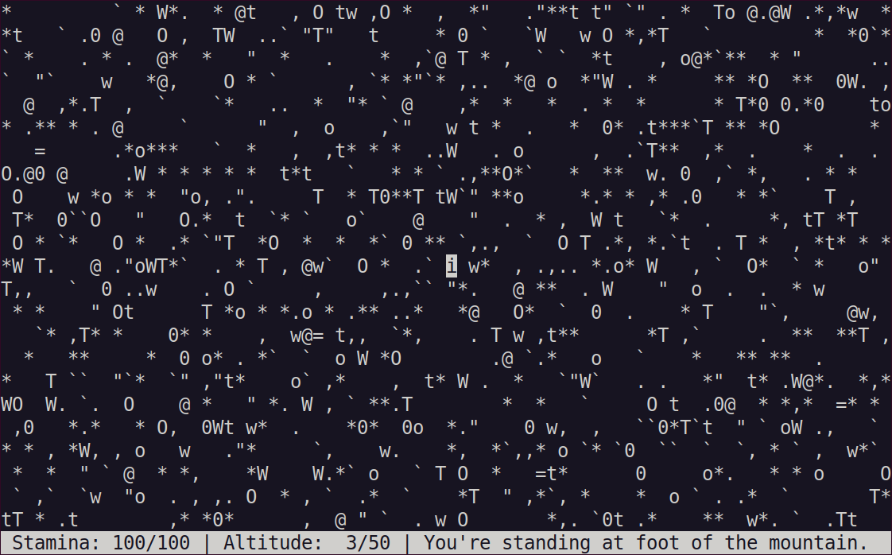

# roguehike

A minimalistic roguelike hiking game in Clojure. Go climb a mountain here!

[See gameplay on YouTube.](https://www.youtube.com/watch?v=NQ6feqqXHTw)

You are standing at foot of the mountain. If you ascend the mountain and then return to wilderness edge, you win. If you give up and quit, you lose. There is no saving, just as in real life.

Status bar is located at the bottom of the screen. It shows your current stamina in percents of your maximum stamina, current and maximum altitude on this terrain, direction to the summit, and status message. Direction: < means "summit is on the west from you", > means "on the east", ^ means "on the north", v means "on the south". Everything apart status bar is a map shown via top-down view with north on top of the screen.

Use **numpad (1-4, 6-9)** or **vi keys (hjklyubn)** for moving. Press **5** or **r** to rest. Press **c** to redraw the screen placing user in its center. Press **q** to quit.

"i" symbol on the screen is you, hiker. Other used symbols and their meanings are:

Non-obstacles:
|Symbol|Meaning|
|:----:|:-----:|
|space|ground|
|. , `|stone|
|*|moss|
|"|tall grass|
|o|small rock|
|w|small bush|
|t|small tree|

Obstacles:
|Symbol|Meaning|
|:----:|:-----:|
|0 O|big rock|
|W|big bush|
|T|big tree|
|@|puddle|
|=|fallen tree|

And don't forget: mountains are always worth climbing!

## Running

First optional argument is terminal type to launch the game in: auto, swing, text, unix, cygwin. Default on *nix: unix, default on Windows: auto.

## Building

Requires Leiningen.

To run:

    lein run

To build a release jar (pick up standalone one):

    lein uberjar

## Inspiration

Zmeinaya Mountain (Karelia, Russia) located at 61.480991, 30.217564.

Videos on YouTube: [one](https://www.youtube.com/watch?v=RatzV-C6QtI), [two](https://www.youtube.com/watch?v=z_yjNECbgzU), [three](https://www.youtube.com/watch?v=L1GLNxfAmP4).

Photos on LiveJournal: [one](https://trekking-hiking.livejournal.com/94575.html), [two](https://lenoblast-pohod.livejournal.com/111665.html), [three](https://pohod-vosemvrat.livejournal.com/104778.html).

## License

Source code: MIT/X11

Copyright 2024 Ivan Zuboff

Copyright 2012 Steve Losh (his [zen project](https://github.com/sjl/zen) served as base for this one)
